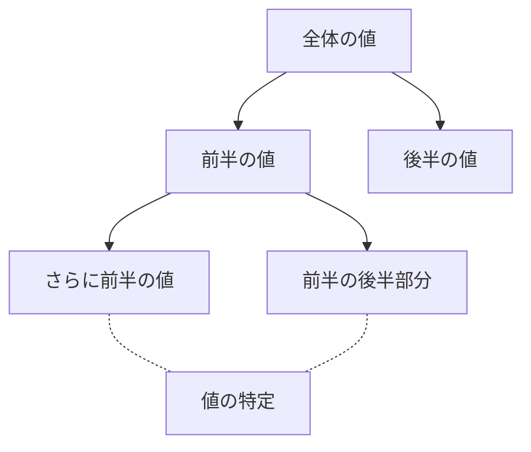
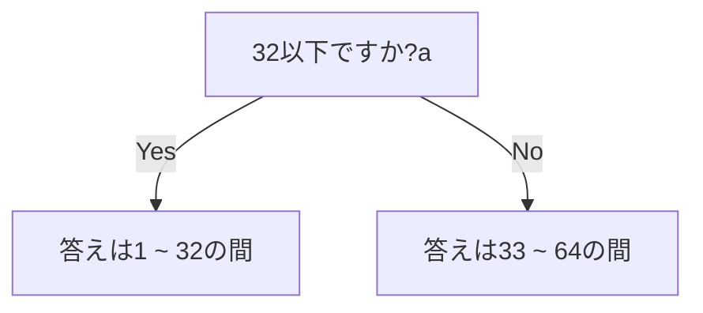
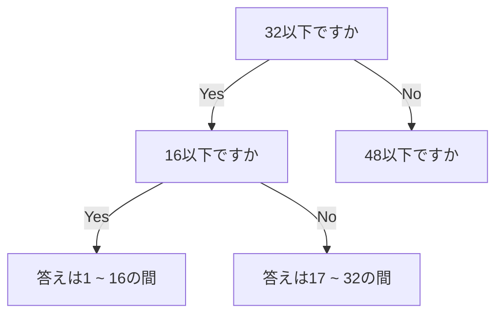
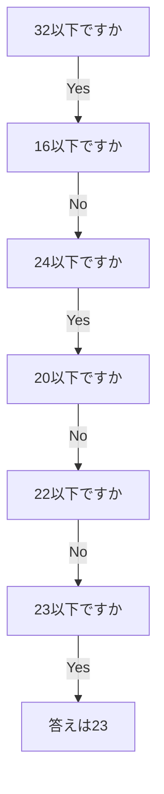

# 二分探索とは
中央で区切ることで探索範囲を半分ずつにしてくアルゴリズムのこと.
検索したい値との大小関係を用いて,検索指したい値が中央値の右か左かにあるかを判断して片側に存在しないことを確かめながら検索していく.



# どのようなときに使うのか
- ソート済みのデータから特定の値を探すとき
- 大量のデータから値を探す必要があるとき
- 事前にデータがソート済みの時

## 二分探索を使う際の条件
二分探索を用いる際に必要な条件は次のとおりである.

- ソート済みのデータ
- 配列やリストなどの連続したデータ構造
- 探索キーの単一性
- アクセスが効率的

これらの条件を詳しく見ていく.

### ソート済みのデータ
二分探索を適用するためには,探索対象のデータがソート済み[^1]である必要がある.ソートされていないデータに対して,二分探索を行うと正しく動作しない.

### 配列やリストなどの連続したデータ構造
二分探索は,配列やリストなどの連続したデータ構造に対して効果的である.理由としては,中央値を計算し,その位置の値と目標値を比較できる必要があるためである.

### 探索キーの単一性
探索対象のデータが単一のキー(値)である必要がある.複数のキーを組み合わせたデータに対しては適用することができない.

### アクセスが効率的
配列やリストの任意の位置の要素にランダムアクセスできる必要がある.リンクリストのように,先頭から順にたどる必要があるデータ構造に対しては二分探索は不適切である.

二分探索の一般化したコードを下記に書く.

```C++
#include <iostream>
#include <vector>
using namespace std;

int binarySearch(vector<int>& nums, int target) {
    int left = 0;
    int right = num.size() - 1;
    
    while(left <= right) {
        int mid = left + (right - left) / 2;

        if(nums[mid] == target) {
            return mid;
        } else if(nums[mid] < target) {
            left = mid + 1;
        } else {
            right = mid - 1;
        }
    }

    return -1; // target is not in the array
}
```


# 実際に用いるときの例

**`太郎君は1以上64以下の整数を思い浮かべています.あなたはYes / Noでこたえられる質問を6回まで行うことができます.太郎君の思い浮かべている整数を当ててください.`**

ここでこの問題に答える場合,線形探索(全探索)では6回で当てることは非常に困難である.

## 解き方
あり得る候補の中央で区切る質問を繰り返すことで確実に6回で当てることができる.

→二分探索

## 1回目



## 2回目


## 最後までする
これを最後まで繰り返していくと以下のようになる.


